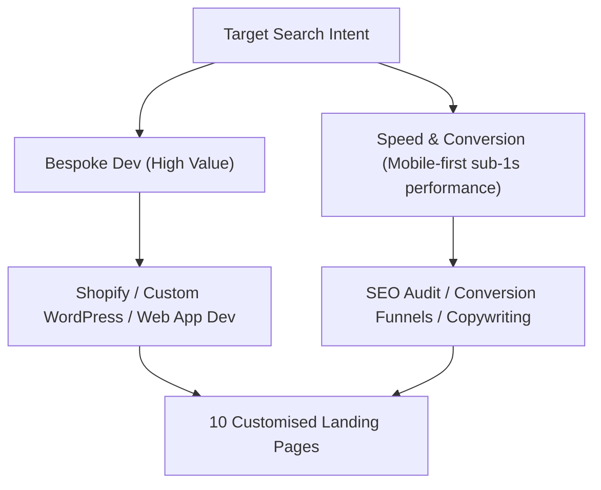

# Cr8v Stacks — SEO Strategy & Research Report
*Last updated: 2026-07-10*

This document details the search engine optimisation (SEO) strategy, target keyword matrix, and page layout architectures designed for **Cr8v Stacks** — targeting global clients with a positioning centred on technical excellence over generic template-agency offerings.

---

## 🎯 High-Level Search Strategy

Our positioning centres on **"Technical Execution + Strategic Copywriting"** — targeting buyers who need high-performance, fast-loading, custom digital platforms and have been burned by bloated builder solutions.



---

## ⚡ Technical SEO Foundation

These standards apply to ALL 10 service pages:

| Metric | Target |
|---|---|
| LCP (Largest Contentful Paint) | < 1.5s |
| FID / INP (Interaction to Next Paint) | < 100ms |
| CLS (Cumulative Layout Shift) | < 0.1 |
| Mobile PageSpeed Score | 95+ |
| Desktop PageSpeed Score | 99+ |
| TTFB (Time to First Byte) | < 200ms |

**Schema types per page:**
- All service pages: `Service`, `BreadcrumbList`, `FAQPage`
- Homepage: `Organization`, `WebSite`, `SiteNavigationElement`
- Portfolio/case studies: `CreativeWork`

**Canonical URL structure:**
```
cr8vstacks.com/services/                    ← main hub
cr8vstacks.com/services/web-design/         ← page 1
cr8vstacks.com/services/woocommerce/        ← page 10
```

---

## 📊 Target Keyword & Scoping Matrix

| # | Service Page | Primary Keyword | Secondary Keywords | Starter Price | Differentiator |
|---|---|---|---|---|---|
| 1 | **Website Design & Dev** | Custom web design agency | Bespoke website, web development agency | $1,200 | Before/After Speed Slider |
| 2 | **Brand Strategy** | Brand strategy consultant | Corporate positioning, brand messaging | $800 | Competitor Matrix Compare |
| 3 | **Brand Identity Design** | Brand identity designer | Logo design, visual identity | $800 | Style Palette Graphic |
| 4 | **Digital Marketing** | Digital marketing agency | Meta ads, conversion funnels, lead gen | $1,000 | Funnel Leak vs Active Compare |
| 5 | **SEO & Content** | Technical SEO agency | Search optimisation, SEO copywriting | $600 | Bloated vs Crawl-Ready Compare |
| 6 | **Shopify Storefronts** | Shopify development agency | Custom Shopify theme, Liquid developer | $1,800 | Before/After Storefront Slider |
| 7 | **WordPress Themes** | WordPress developer | Custom WordPress theme, Gutenberg dev | $1,200 | PageSpeed 99 Result Slider |
| 8 | **Bespoke Web Dev** | Web application developer | Custom database, API integration | $2,500 | Before/After Admin Panel |
| 9 | **AI MVP Development** | AI prototype developer | LLM development, AI software | $3,500 | Prompt Layer vs Static Compare |
| 10 | **WooCommerce Dev** | WooCommerce developer | Custom WooCommerce, WordPress shop | $1,800 | Before/After Checkout Slider |

---

## 📝 10-Page Content & Case Study Blueprints

### Page 1: Website Design & Development
- **Focus**: Custom-coded premium landing pages and corporate portals. No templates, no bloat.
- **Case Study**: *MKenny Properties* (UK real estate portal — 0.4s speed, +180% lead growth).
- **Stack fan cards**: WordPress · Figma · HTML/CSS
- **Target ranking**: "custom web design agency" — 6-month goal: top 5 organic.

### Page 2: Brand Strategy
- **Focus**: Whitespace brand positioning, competitor matrix audits, value proposition copywriting.
- **Case Study**: *Zenith Cloud Stack* (US SaaS brand — whitespace brand messaging, 95% brand positioning index score).
- **Stack fan cards**: Miro · Notion · Google Slides
- **Target ranking**: "brand strategy consultant" — 6-month goal: top 10 organic.

### Page 3: Brand Identity Design
- **Focus**: Custom logo design, typography styling, colour palette rules, motion identity (Rive).
- **Case Study**: *Lumos Energy* (Global renewable energy firm — custom logo + motion brand assets, 200% brand recognition index).
- **Stack fan cards**: Figma · Photoshop · Rive
- **Target ranking**: "brand identity designer" — 6-month goal: top 10 organic.

### Page 4: Digital Marketing
- **Focus**: Meta Ads, Google Ads, server-side Conversion APIs, automated email marketing sequences (Klaviyo).
- **Case Study**: *Apex Telehealth* (US telehealth platform — server-side tracking setup, -42% customer acquisition cost).
- **Stack fan cards**: Meta Ads · Google Ads · Klaviyo
- **Target ranking**: "conversion funnel agency" — 6-month goal: top 10 organic.

### Page 5: SEO & Content
- **Focus**: Technical crawl audits, schema markups, keyword mapping, human-first copywriting.
- **Case Study**: *Blvck Hair NG* (Nigerian organic search brand — technical SEO audit, +310% indexed traffic).
- **Stack fan cards**: Screaming Frog · Semrush · WordPress
- **Target ranking**: "technical SEO agency" — 6-month goal: top 5 organic.

### Page 6: Shopify Storefronts
- **Focus**: Custom Shopify theme development in Liquid. App-free dynamic product cards and slide-out carts.
- **Case Study**: *Sienna & Co* (Global fashion boutique — custom Liquid theme, 0.5s mobile speed, zero apps).
- **Stack fan cards**: Shopify · Liquid · JavaScript
- **Target ranking**: "custom Shopify developer" — 6-month goal: top 5 organic.

### Page 7: WordPress Themes
- **Focus**: Custom WordPress block-editor theme development. No Elementor, no Divi, no heavy builders.
- **Case Study**: *Vanguard Capital Group* (Global investment firm — native Gutenberg block theme, 99/100 mobile PageSpeed score).
- **Stack fan cards**: WordPress · PHP · Gutenberg
- **Target ranking**: "custom WordPress developer" — 6-month goal: top 5 organic.

### Page 8: Bespoke Web Dev
- **Focus**: Custom web applications, databases (MySQL/PostgreSQL), and whitelabel client admin panels.
- **Case Study**: *Apex Logistics Platform* (US/Global logistics — custom database + whitelabel dashboard, 0.01s query executions).
- **Stack fan cards**: React · Node.js · MySQL
- **Target ranking**: "web application developer" — 6-month goal: top 10 organic.

### Page 9: AI MVP Development
- **Focus**: LLM prompt engineering, OpenAI & Claude API integrations, Supabase backends, fast MVP prototypes.
- **Case Study**: *Lexis Search AI* (US legal tech startup — custom LLM prompt layer + Claude integration, 3-week prototype launch).
- **Stack fan cards**: Python · OpenAI API · Claude
- **Target ranking**: "AI prototype developer" — 6-month goal: top 10 organic.

### Page 10: WooCommerce Development
- **Focus**: Self-hosted WordPress e-commerce. Custom cart, checkout, and product logic. No plugin dependencies.
- **Case Study**: *Aura Organics* (Global cosmetics storefront — custom PHP checkout hooks, -35% checkout bounce-rate, 0.4s load).
- **Stack fan cards**: WooCommerce · WordPress · PHP
- **Target ranking**: "WooCommerce developer" — 6-month goal: top 5 organic.

---

## 🔗 Internal Linking Architecture

```
services/ (main hub)
├── links to → all 10 service pages
├── links to → portfolio/case studies
│
web-design/ → links to → shopify/, wordpress/, custom-dev/
woocommerce/ → links to → shopify/, wordpress/, custom-dev/
brand-strategy/ → links to → brand-identity/, digital-marketing/
seo-content/ → links to → digital-marketing/, web-design/
ai-mvp/ → links to → custom-dev/, wordpress/
```

**Rule**: Each service page links to 3 related service pages in the "Related Services" section at the bottom.

---

## 📅 Content Engine (Blog / Pillar Pages)

Target 2 blog posts per month per service tier. Initial priority:

| Month | Topic | Target Keyword |
|---|---|---|
| 1 | "Why custom WordPress beats Elementor for speed" | WordPress speed optimisation |
| 1 | "WooCommerce vs Shopify: real build cost comparison" | WooCommerce vs Shopify |
| 2 | "How we hit 99 PageSpeed on every build" | PageSpeed 99 tutorial |
| 2 | "What a brand strategy actually includes" | brand strategy guide |
| 3 | "The real cost of a Shopify app stack" | Shopify app alternatives |
| 3 | "Building an AI MVP in 3 weeks" | AI MVP development guide |

---

## 🔍 Backlink Acquisition Strategy

1. **Niche directories**: Submit to Clutch.co, DesignRush, GoodFirms, and Sortlist.
2. **Guest posts**: Target web dev, SaaS, and e-commerce blogs (no popular mainstream publications that would expect portfolio depth beyond current stage).
3. **Case study PR**: Pitch Aura Organics, MKenny Properties, and Vanguard Capital Group results to niche trade publications.
4. **Resource links**: Create linkable assets (e.g. "PageSpeed calculator", "WooCommerce vs Shopify cost tool") that earn natural backlinks.
